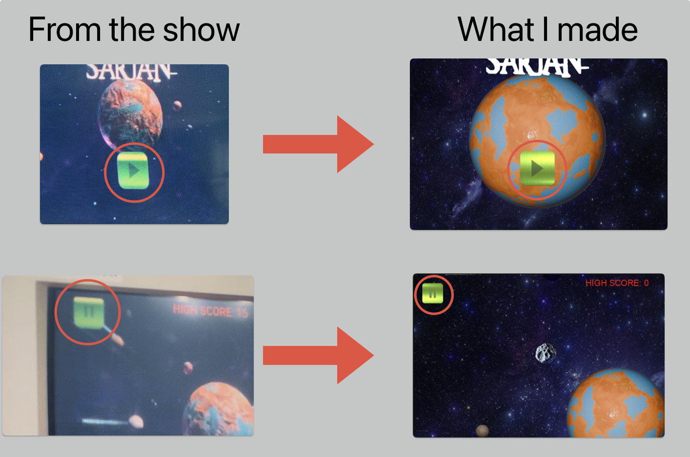
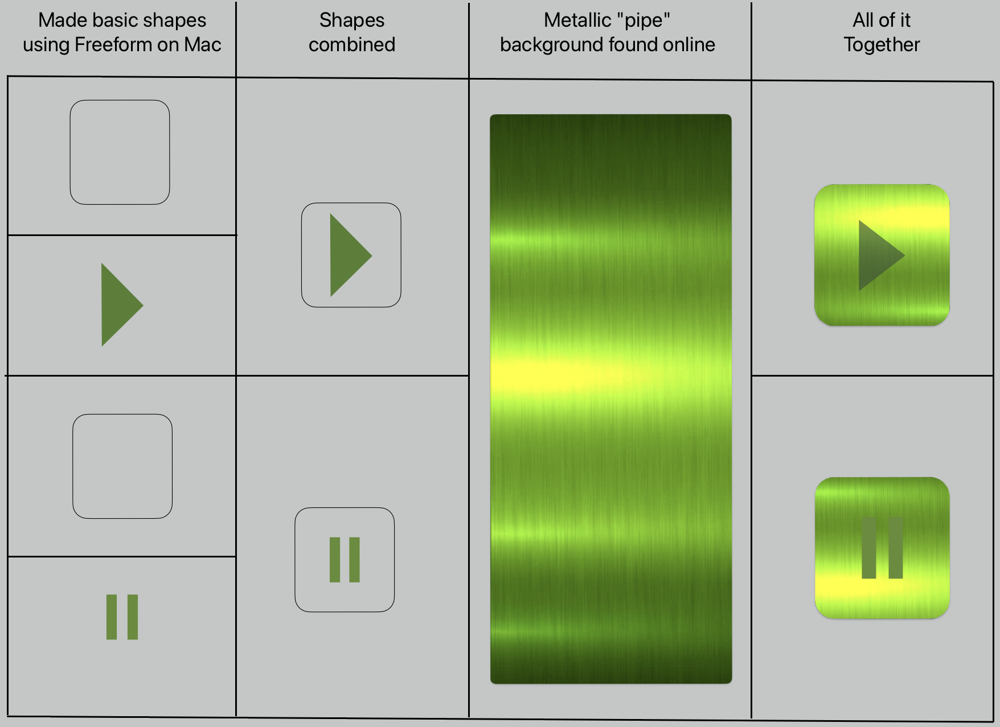
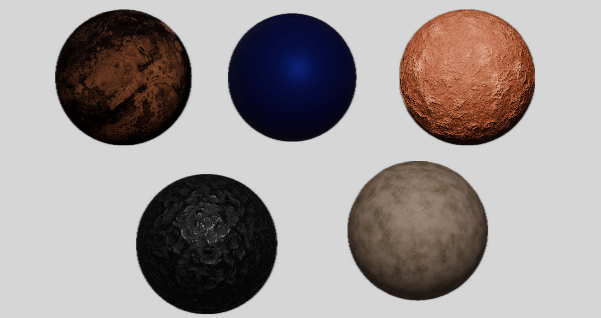
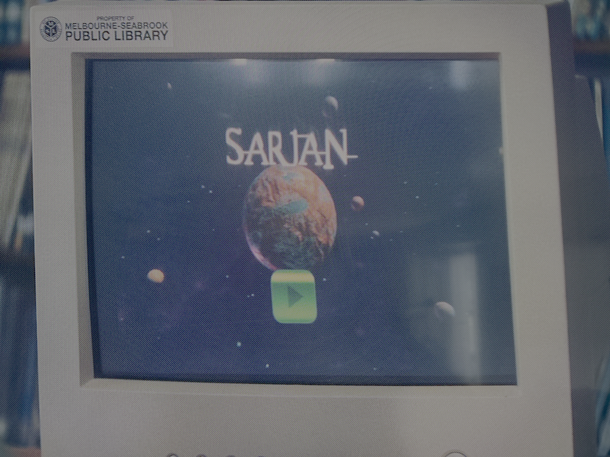
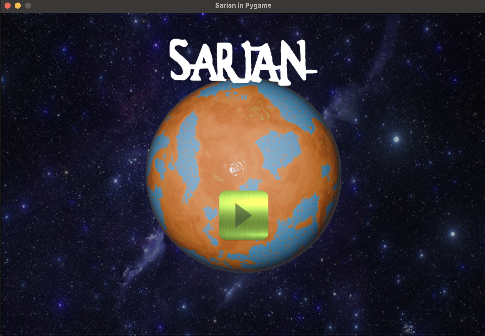
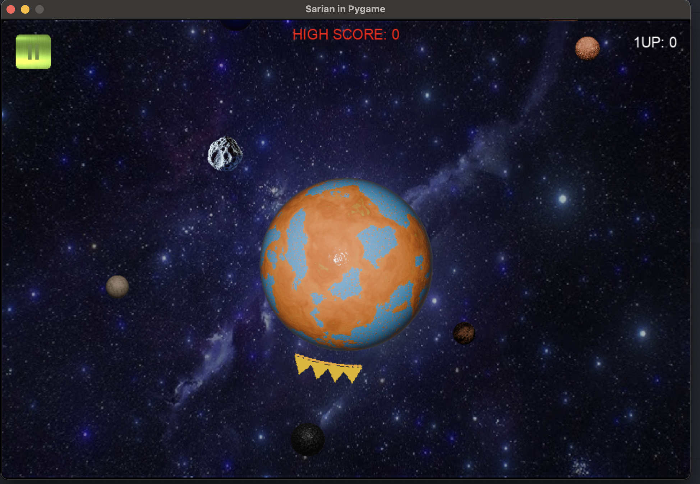

# SARIAN

A **Python/Pygame** recreation of the fictional game **Sarian** from Apple TV’s _Mythic Quest_. In this version, which I like to call **_pySARIAN_**, you defend a planet from incoming asteroids using a rotating shield, racking up points for each blocked asteroid!

---

## Table of Contents
1. [About the Project](#about-the-project)
2. [Features](#features)
3. [How to Play](#how-to-play)
4. [Roadmap](#roadmap)
5. [Screenshots](#screenshots)
6. [Credits](#credits)

---

## About the Project
In the show _Mythic Quest_, Season 3, Episode 7 [**Sarian**](https://www.imdb.com/title/tt21356646/?ref_=ttep_ep_7) is briefly shown as a fictional in-universe game. It's a game Ian had made in the 90's, that a young Poppy found while perusing the internet in the Melbourne-Seabrook Public Library. 

This project aims to bring that concept to life with Python, using [Pygame](https://www.pygame.org/docs/). Since there is only ~9 seconds of actual gameplay shown in the episode, there was not a lot to work with. But I was up for the challenge, and had a ton of fun working on this. 

I used Blender to create the moons and the planet. And I used a combo of GIMP and Freeform(mac) for any images. The planet it there now is a placeholder until I complete sculpting the actual main planet. It should be updated in the coming weeks. 

### Creating the buttons from scratch:

### Moons I made using Blender:

---

## Features
- **Central Planet & Rotating Shield**  
  Protect your planet by rotating a shield that blocks incoming asteroids.

- **Arcade-Style Scoring**  
  Earn “+1” each time you successfully block an asteroid, and watch your **1UP** (current score) climb. Keep an eye on the **HIGH SCORE** for the session.

- **Particle Effects**  
  Asteroids explode into dust on impact with the shield, adding visual flair.

- **Moons & Orbiting Bodies**  
  Five decorative moons rotate around the planet on fixed orbits, purely for eye candy.

- **Pause/Resume**  
  Toggle the game state via the pause button or the **Space/P** keys.

- **Session-Based High Score**  
  Once the window closes, your high score resets, just like classic arcade cabinets.

---

  ## How to Play
1. Launch the game using the command above.
2. Title Screen: Click the Play button to start.
3. Controls:
    - Left/Right Arrow Keys (or A/D) to rotate the shield around the planet.
    - P or Spacebar to pause/unpause.
    - Mouse: Click the pause button in the top-left to pause.
4. Objective:
    - Block asteroids with your shield to protect your planet.
    - Each blocked asteroid grants you +1 to your current score (“1UP”).
    - Keep playing until your planet’s lives run out (internally tracked, not shown).
    - A new session resets your score and planet lives, but HIGH SCORE remains until the game closes.

---

  ## Roadmap
- **Custom Planet Model**: Integrate a higher-quality planet sprite or 3D render from Blender.
- **Enhanced Title Font**: Replace the “SARIAN” text with a custom font or stylized sprite matching the show.
- **Additional Effects**: Larger dust explosions, more dramatic visuals, or sound effects.
- **High Score Persistence**: Optionally save the highest score to a file so it persists across sessions.
---

  ## Screenshots

The start screen from the show:

A still during gameplay from my Python version:

A still during gameplay from the show:

A still during gameplay from my Python version:

---

  ## Credits 
- **Idea & Inspiration**: [MythicQuest](https://www.imdb.com/title/tt8879940/?ref_=nv_sr_srsg_0_tt_7_nm_1_in_0_q_mythi) on [Apple TV+](https://tv.apple.com/channel/tvs.sbd.4000?mttn3pid=Google%20AdWords&mttnagencyid=a5e&mttncc=US&mttnsiteid=143238&mttnsubad=OUS2019801_1-713951819730-c&mttnsubkw=178273365529__idXQ476O_&mttnsubplmnt=0AAAAAC0Rhi2ts1ZiPer5lyWZVDU0o2gPk)
- **Development**: [Mack Oyler](https://github.com/MackOyler)
- **Tools & Libraries**: Python, Pygame, Blender